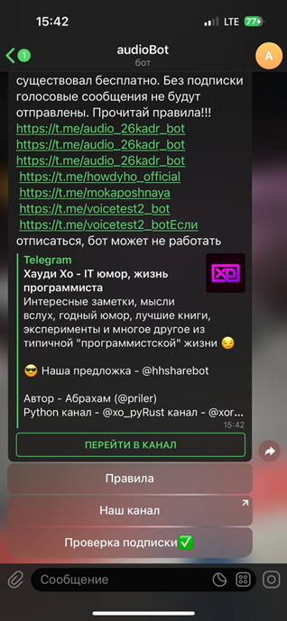
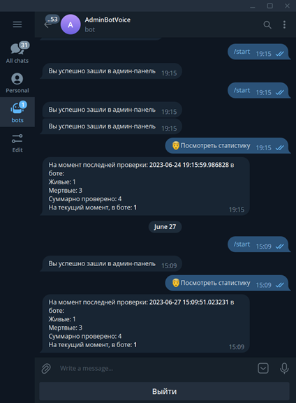
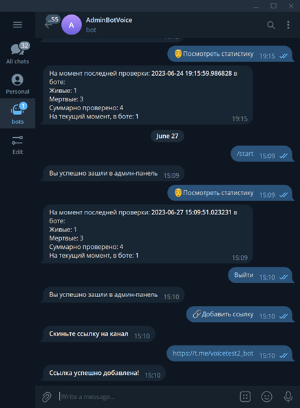

<div align="center">


<p>A bot that converts text into a voice message</p>
</div>

## How to install and start? 

```
python3 pip install -r requirements.txt

python3 main.py 

python3 admin.py
```

## Functions 

- converting text into a voice message 
- converting a voica message to text 
- channel subscription verification 
- viewing statistics 
- language selection (Russian, English)

## Stack

- Python. Aiogram
- PostgreSQL
- Docker

## Demo

User panel: 

Text-to-speech


Speech-to-text


If you are not subscribed: 




Admin panel: 




## Docker

```
docker build -t bot .

docker run -e TOKEN= -e TOKEN2=  -e ADMIN_ID= -e DB_URI= bot

docker-compose up
```

## Support 

If you want to support me, click "🌟" on this project😊

### Further ideas

Add a "Settings" button with language selection, so that there is a translation of buttons, functions, etc.

# Бот, занимающийся конвертацией текста в голосовое сообщение

## Как установить и запустить бота?

```commandline
python3 pip install -r requirements.txt

python3 main.py 

python3 admin.py
```

## Функции 

- конвертация текста в голосовое сообщение 
- конвертация голосового сообщения в текст
- проверка подписки на канал 
- просмотр статистики 
- выборка языка(русский, английский)

## Технологии

- Python. Aiogram
- PostreSQL
- Docker

## Демонстрация 

Панель пользователя: 

Text-to-speech


Speech-to-text


Если не подписан: 


Панель администратора:


## Docker 

```commandline
docker build -t bot .

docker run -e TOKEN= -e TOKEN2=  -e ADMIN_ID= -e DB_URI= bot

docker-compose up
```

## Поддержка

Если хотите поддержать меня, то нажмите "🌟" на этот проект😊

### Дальнейшие идеи

Добавить кнопку "Настройки" с выбором языка, чтобы был перевод кнопок, функций и тому подобное
